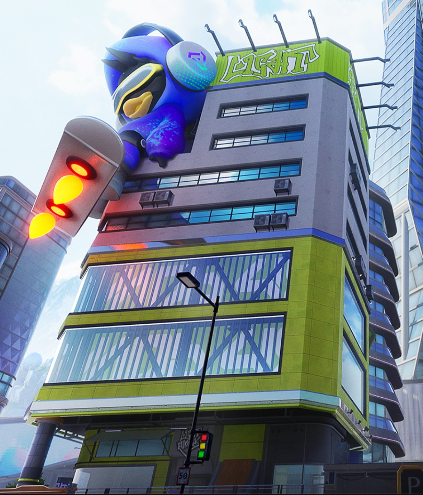
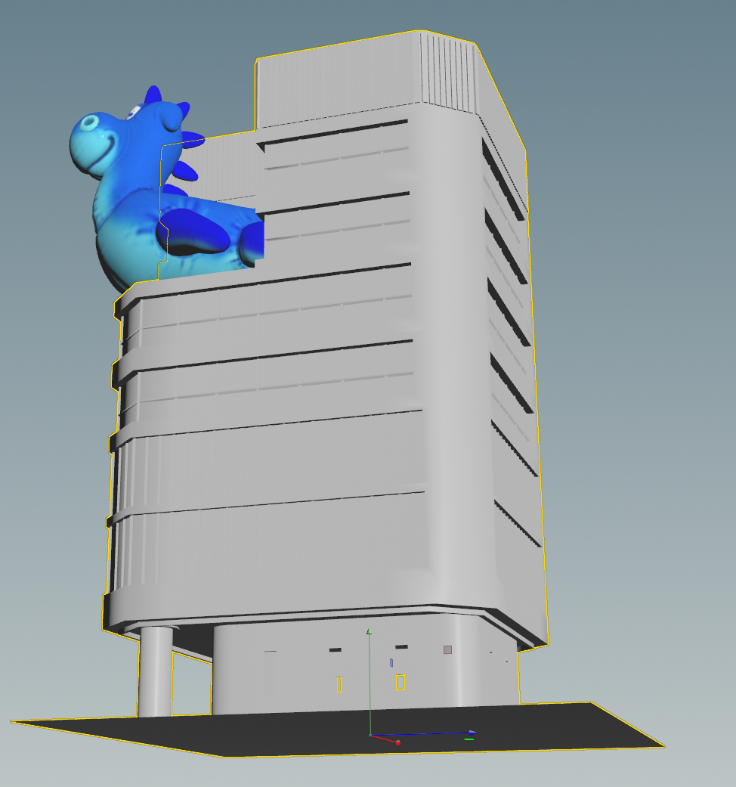
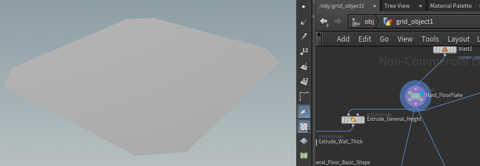
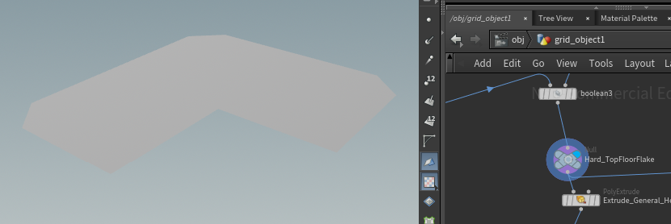
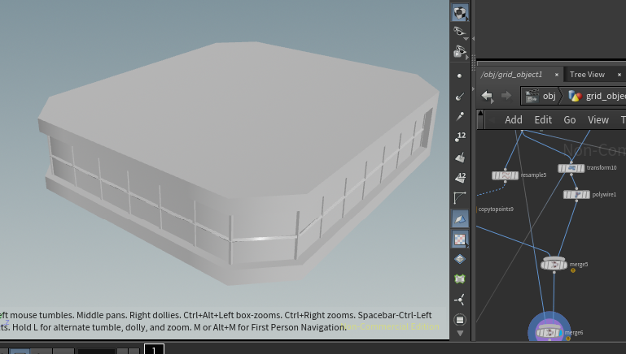
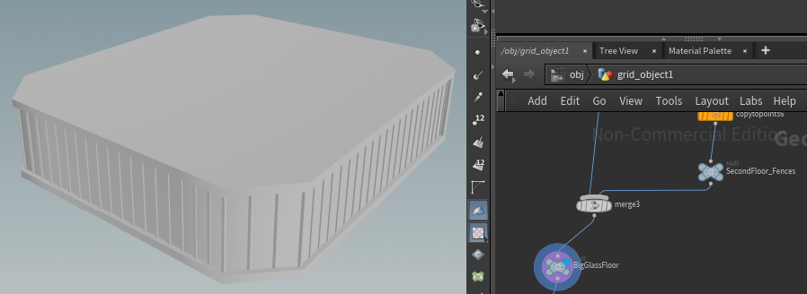
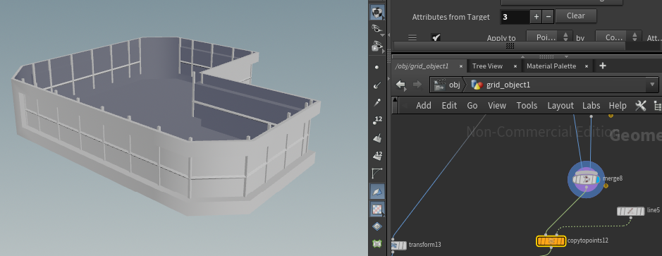
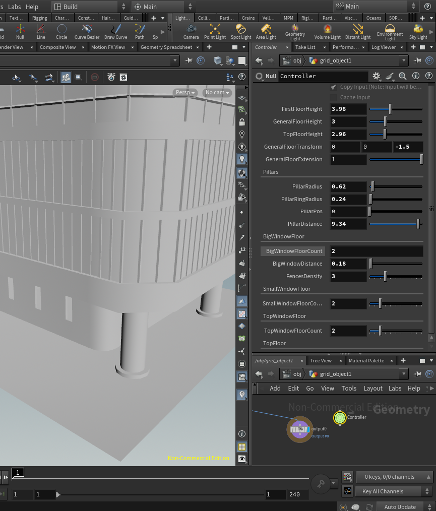

# Procedural Buildings

## Project Overview

In this project, I replicate the building from the game [Farlight84](https://store.steampowered.com/app/1928420/Farlight_84/). 

The reference building is a tall and modern skyscraper with four main parts:

1. A **giant blue mascot** on a hoverboard sitting aside the green roof.
2. A **gray upper section** with small, wide windows.
3. A **bright green middle section** that sticks out and has large glass windows.
4. A **lobby** at the bottom of the building.

##  Houdini Setup 
Each section of the building is modeled and then combined together using appropriate alignment. The size of the building is also customizable for easy adaptation.

### Basic Shape

### Modeled Floor

### Controller

